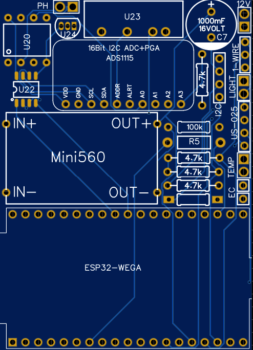
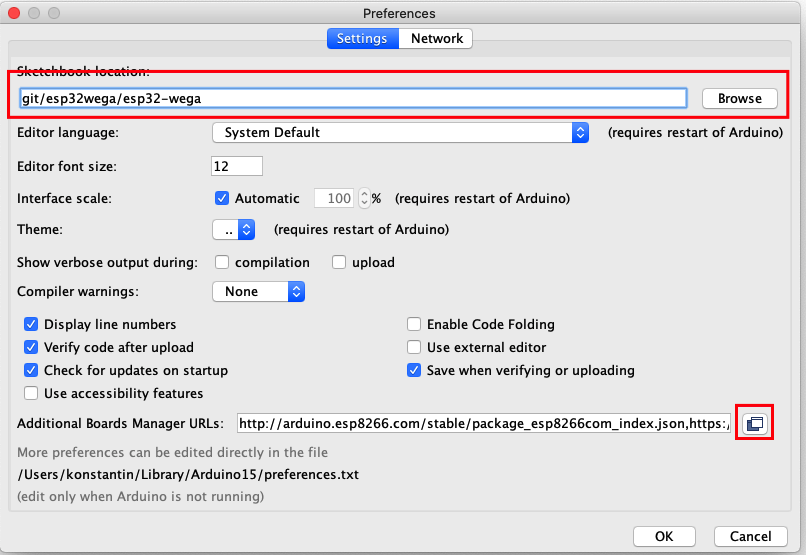
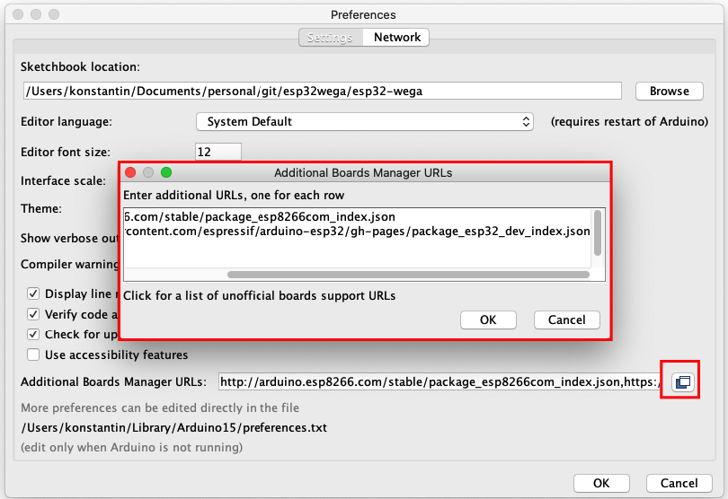
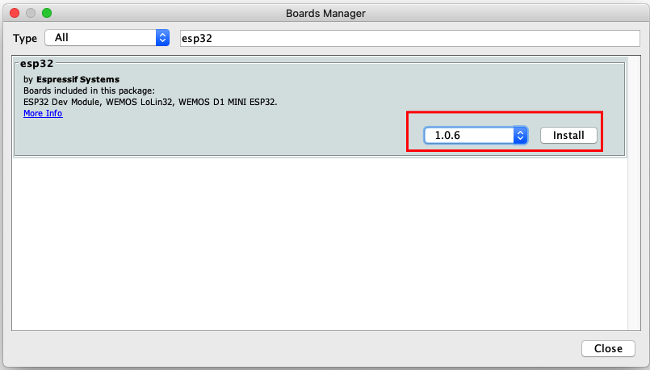
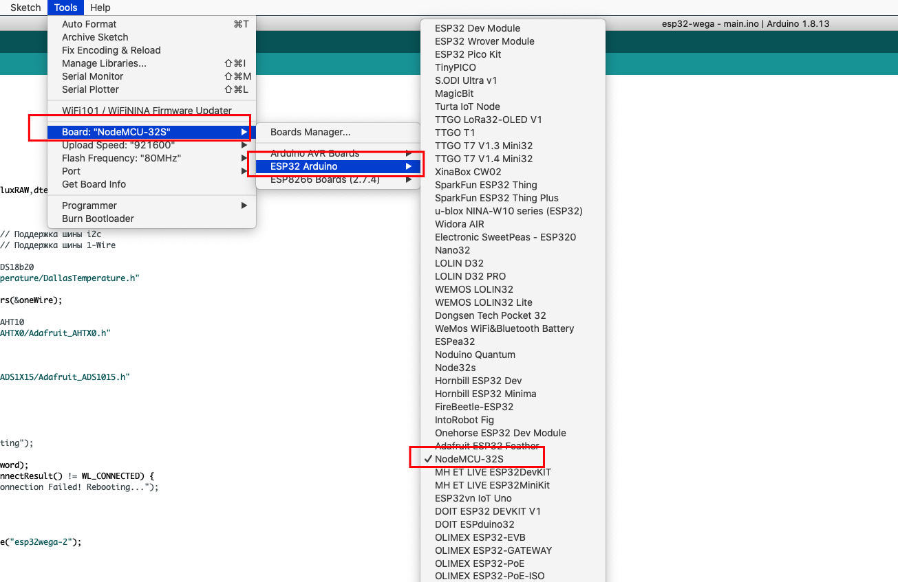
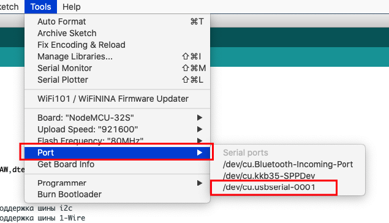
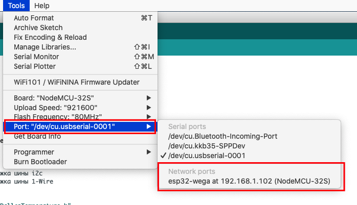
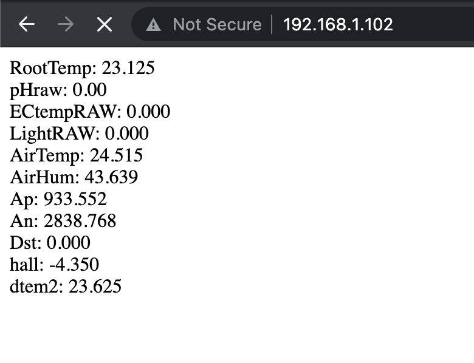

# esp32wega
Web Electronic Garden Automatic on ESP32 project.
https://t.me/esp32wega

Содержание 
=================
<!--ts-->
* [Минимальные требования и знания](#what_to_know)
* [Схема подключения компонентов](#schema)
* [Что потребуется купить(ESP32, датчики, резисторы)](#what_to_buy)
* [PCB плата](#pcb)
* [Установка софта](#install)
  * [Arduino IDE](#arduino)
  * [Additional Boards Manager URLs](#boards_manager)
  * [Установка платы ESP32](#esp_board_install)
  * [Visual Studio Code configuration](#vscode)
* [Залив прошивки esp32wega](#esp_wega)
* [Компоненты для модуля измерения pH](#ph)
* [Корпуса для 3D печати](#3d)
* [Калибровка EC](#ec)
* [Где искать помощь](#help)

<!--te-->

<a name="what_to_know"></a>

### Минимальные требования и знания

Для того, чтобы собрать этот миксер необходимо:

- Минимальные знания в электронике (знать что такое `+` или `GND`)
- Умение читать схему, да-да, именно читать, а не разглядывать и смотреть
- Знание, что такое паяльник и как с ним работать
- Понимание как соединить три проводка в одной точке
- Умение собирать компоненты по схеме
- Знать и уметь, как прошивать ардуину и вообще знать, что это такое
- Минимальные знания в программировании. Мы попытались минимизировать необходимость ковыряние в коде, но все же придется изменять некоторые значения, о которых речь пойдет ниже

Если, всего выше перечисленного или одного из выше перечисленного не знаешь, не умеешь, не понимаешь, найди человека, который соберет этот миксер за тебя.


<a name="schema"></a>
## Схема подключения
<a href="images/esp32-wega-v4.jpg"></a>

<a name="what_to_buy"></a>
## Компоненты для заказа
 1. Плата контроллера ESP32 https://aliexpress.ru/item/4000115960206.html
 1. Датчик влажности ATH10 https://aliexpress.ru/item/4000961263862.html
 1. Фоторезистор 5528 для измерения света https://aliexpress.ru/item/1125719348.html
 1. Датчик расстояния для измерения уровня https://aliexpress.ru/item/4000899658467.html
 1. Стабилизатор для питания контроллера MP1584E https://aliexpress.ru/item/32706897605.html
 1. Терморезистор 100кОм для компенсации ЕС https://aliexpress.ru/item/32865194243.html или https://aliexpress.ru/item/32957320014.html
 1. Водонепроницаемый ds18b20 датчик температуры корней https://aliexpress.ru/item/32832225749.html
 1. Монтажная плата https://aliexpress.ru/item/32546265487.html или https://www.aliexpress.com/item/32512415633.html
 1. Набор резисторов https://www.aliexpress.com/item/1005002275520555.html
 1. Провода ...

<a name="pcb"></a>
#### PCB плата
PCB плата находится в стадии активной разработки и тестирования, по этому если планируете заказать плату то иммейте ввиду, что нет ни какой гарантий,
что все будет работать как надо.

PCB плата [ESP32-WEGA](https://oshwlab.com/siv237/esp32wega4)

<a href="images/pcb-esp32-wega.png"></a>

<a name="install"></a>
### Установка софта(Install software)

<a name="arduino"></a>
#### Arduino IDE
[Install Arduino IDE](https://www.arduino.cc/en/software)

Запускаем Arduino IDE, прописываем путь к `Additional Boards Manager URLs` для нашей ESP, устанавливаем нашу плату(board)

<a name="boards_manager"></a>
**Additional Boards Manager URLs**

File -> Preferences

<a href="images/prefs.png"></a>

И здесь нам надо изменить две вещи.

1. Необходимо указать расположение вашей папки с esp32 проектом/скетчами, где находятся файлы ардуины.

<a href="images/sketch_location.png"></a>

2. Добавить ссылку на конфиг файл для установки esp32 платы. Для этого необходимо скопировать ссылку, которая приведена ниже и вставить ее в поле, которое откроется при нажатии кнопки, которая выделена красным квадратом

`https://raw.githubusercontent.com/espressif/arduino-esp32/gh-pages/package_esp32_dev_index.json`

<a href="images/esp_json.png"></a>

<a name="esp_board_install"></a>
**Установка платы ESP32**

Tools -> Board -> Board managers

Ищем `ESP32`, выбираем версию 1.0.6 и нажимаем `intstall`

<a href="images/esp_install.png"></a>

Выбираем правильную плату ESP

Tools -> boards manager -> ESP32 Arduino -> NodeMCU-32S

<a href="images/select_esp_board.png"></a>

Изначальное конфигурирование Arduino IDE закончено

Для поддержки платы в Windows необходимо установить драйвер USB http://www.wch.cn/downloads/CH341SER_ZIP.html

Вы можете пропустить следующий шаг если вы собираетесь использовать vscode как основной IDE


<a name="vscode"></a>
#### Visual Studio Code configuration
<details>
<p>

Если вы планируете использовать vscode как основную IDE для работы с файлами ардуины вам потребуется установить [arduino plugin](https://marketplace.visualstudio.com/items?itemName=vsciot-vscode.vscode-arduino) и сконфигурировать его для работы с вашей платой.

[Здесь видео пример как это сделать](https://www.youtube.com/watch?v=FnEvJXpxxNM)
</p>
</details>

<a name="esp_wega"></a>
### Залив прошивки esp32wega

- Открываем файл прошивки из папки `esp32wega/esp32-wega/esp32-wega.ino`
- Обновляем `ssid` - имя вашей сети и `password` - пароль для вашего WiFi.
- Обновляем `wegaapi` - необходимо вставить IP address WEGA сервера
- Обновляем `wegaauth` - необходимо сгенерировать токен для авторизации запросов через API
- Обновляем `wegadb` - необходимо указать имя базы данных

```bash
const char* ssid = "YOUR_WIFI_NETWORK_NAME";
const char* password = "YOUR_WIFI_PASSWORD";
String wegaapi  = "http://192.168.1.XX/wega-api/esp32wega.php"; 
String wegaauth = "adab637320e5c47624cdd15169276981";              
String wegadb   = "esp32wega";
```

- Сохраняем код
- Подключаем `USB` кабель к `esp` плате и выбираем `Tools -> Port` и выбираем ваш порт консольного подключения

<a href="images/upload.png"></a>

- Нажимаем upload/загрузить

Как только код/скетч будет загружен на плату и произойдет перезагрузка, можно увидеть адрес `esp32-wega`, для этого необходимо открыть меню `Tools -> Port`

<a href="images/wifi_address.png"></a>

Теперь можно попробовать зайти на этот адрес через браузер, вы увидете, страницу с данными

<a href="images/web_info_esp.png"></a>


Ну все, код залит, веб сервер работает.

<a name="ph"></a>
## Компоненты для модуля измерения pH
 1. АЦП ADS1115 https://aliexpress.ru/item/32954034047.html
 1. Изолятор питания B1205S-2W https://aliexpress.ru/item/1005001291619304.html
 1. Изолятор шины i2c ADUM1251 https://aliexpress.ru/item/33052971531.html
 1. Плата для распайки изолятора i2c https://aliexpress.ru/item/1728075292.html
 1. Шилд pH https://aliexpress.ru/item/1005001672420703.html
 1. Набор для калибровки pH https://aliexpress.ru/item/33025867435.html

<a name="3d"></a>
## Корпуса для 3D печати
 * Изготовление электрода ЕС: https://t.me/esp32wega/87
 * Корпус для контроллера: https://t.me/esp32wega/2850
 * Корпус датчика уровня: https://t.me/esp32wega/2363
 * Корпус датчика воздуха: https://t.me/esp32wega/2352

## Ещё
 * 2302 все сдохли после влажной осени


<a name="ec"></a>
## Калибровка EC
Для калибровки наиболее удобно использовать аптечный раствор кальция хлорида шестиводного. 
Жидкий в ампулах 100 г/л на 5 или 10 мл.
Можно приготовить три калибровочных раствора 1, 2 и 5 ампул растворить в полулитре (если ампула 10мл то в литре) дистиллята с ЕС 0.01

### Калибровочные растворы:
 * 1 ампула ЕС = 1.114 мсм/см
 * 2 апулы ЕС = 2.132 мсм/см
 * 3 апулы ЕС = 3.107 мсм/см
 * 4 апулы ЕС = 4.057 мсм/см
 * 5 ампул ЕС = 4.988 мсм/см
 * 6 ампул ЕС = 5.909 мсм/см


<a name="help"></a>
### Где искать помощь

Если у вас все еще есть вопросы по настройке, заливке и гонфигурированни этого дозера/миксера, 
то их всегда можно задать в официальном телеграмм канале [esp32-wega](https://t.me/esp32wega)

**!!! ВАЖНО !!!**

Ответы на вопросы, а что такое плюс или GND, а как быть с проводами и так далее в телеграмм канале дававться не будут.

Смотри [Минимальные требования и знания](#what_to_know)

